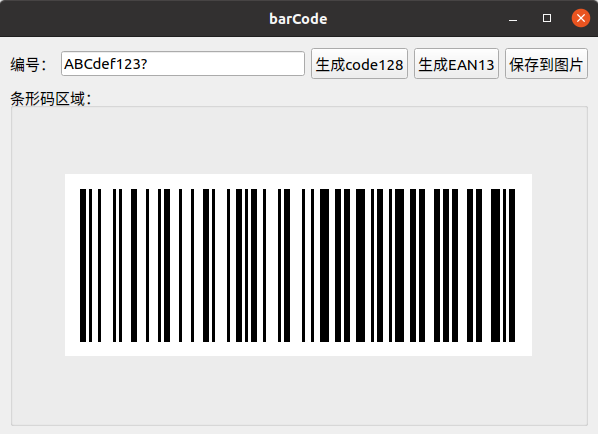
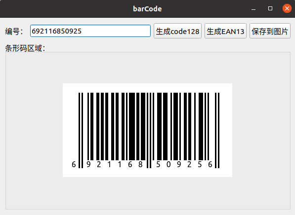
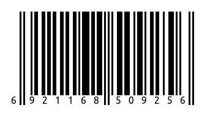

# barCode
这是一个生成条形码的小工具
## 功能概述
该工具目前主要实现了 ***code128B*** 类型条码和 ***EAN13*** 类型条码的编码与生成，关于这两种条码的编码规则，详细可参考doc目录下的文档，这里不再赘述。
## BarCode类接口
```
//Code128B条码接口
static QByteArray generateCode128BCode(const QString &str);
static QImage generateCode128BImage(const QString &str,const int &barCodeHeight = 150,const int &penWidth = 3,const QMargins &margins = QMargins(16,16,16,16));
//EAN13条码接口
static QByteArray generateEAN13Code(QString &str);
static QImage generateEAN13Image(QString &str,const bool &showDigit = true,const int &barCodeMaxHeight = 150,const int &penWidth = 3,const QMargins &margins = QMargins(0,20,4,20));
```
## 运行截图
  
  
  
## 小结
这是在2016年刚到公司实习时，针对一个小需求写的。当时太年轻，接到需求就开始着手研究条形码的编码规则，写了这么一个小工具，而完全没有想到其实有很多成熟的条形码编码及生成库可以用。虽然是重复的制造了一个很普通的轮子，但对于当时来讲，也算是有比较大的收获吧。当然写这么个轮子的更主要的原因是条形码的编码规则相对还算简单，之后又研究了一阵QRcode的编码规则，因为算法太过于复杂，果断用了现成的编码库。  

这个项目目前一共经历了两次重要更新。
第一次是在2023年，因为一个小兄弟邮件反馈说EAN13的编码算法有问题，经过分析发现关于前置码那里确实有bug，当初主要针对国家代码(69)进行了测试验证，其他类别的前置码着实疏忽了。修复bug后，闲着没事又对代码结构进行了些许优化调整，当职业码农重新翻起若干年前的代码，刹那间往事涌上心头。。。。  
第二次是在2026年，因为工作中恰好又遇到了生成条形码的需求，打开这个项目看了一遍，感觉之前主要以功能实现为主，但作为基础工具组件还不太方便使用，很难直接移植调用。所以又大刀阔斧重新改了一遍。唉，2026年了，在AI编程已经逐步取代程序员的时代，谁还能理解传统程序员手撸代码、偏爱古法编程的乐趣呢。。。。

## 作者联系方式
**邮箱:justdoit_mqr@163.com**  